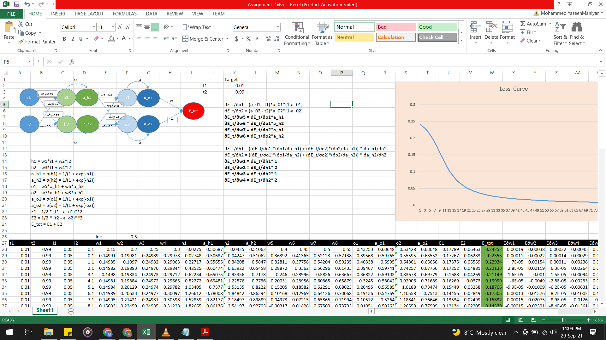
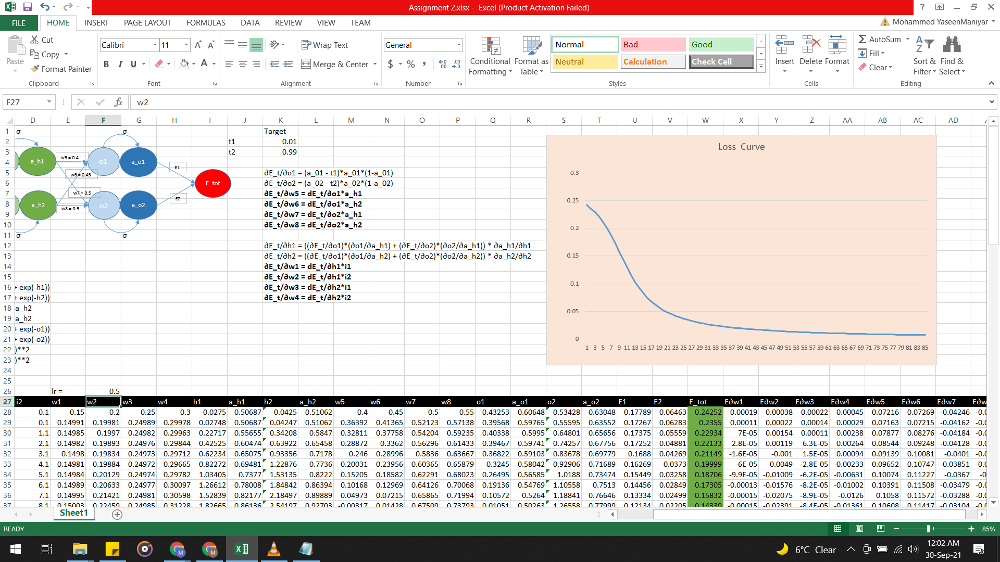
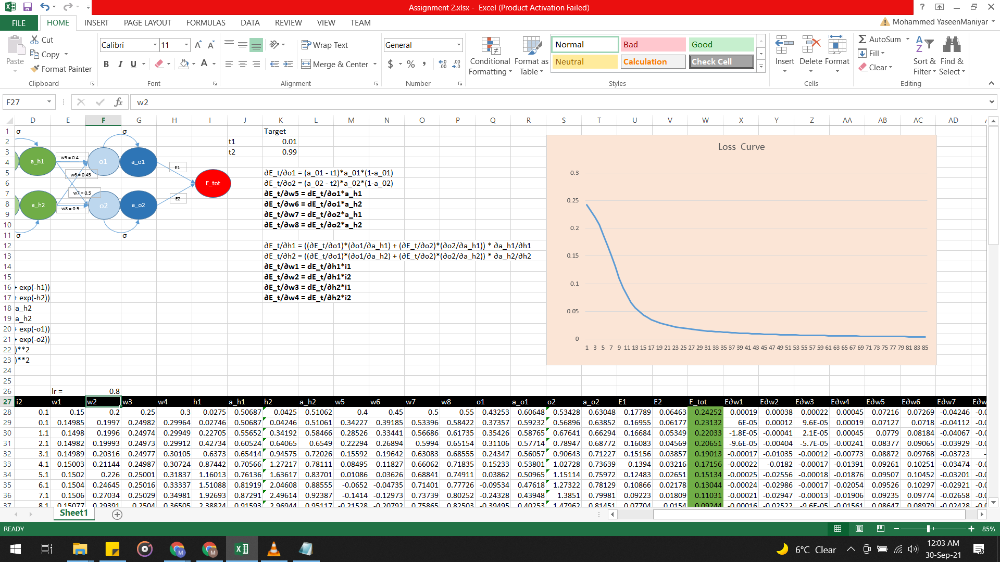
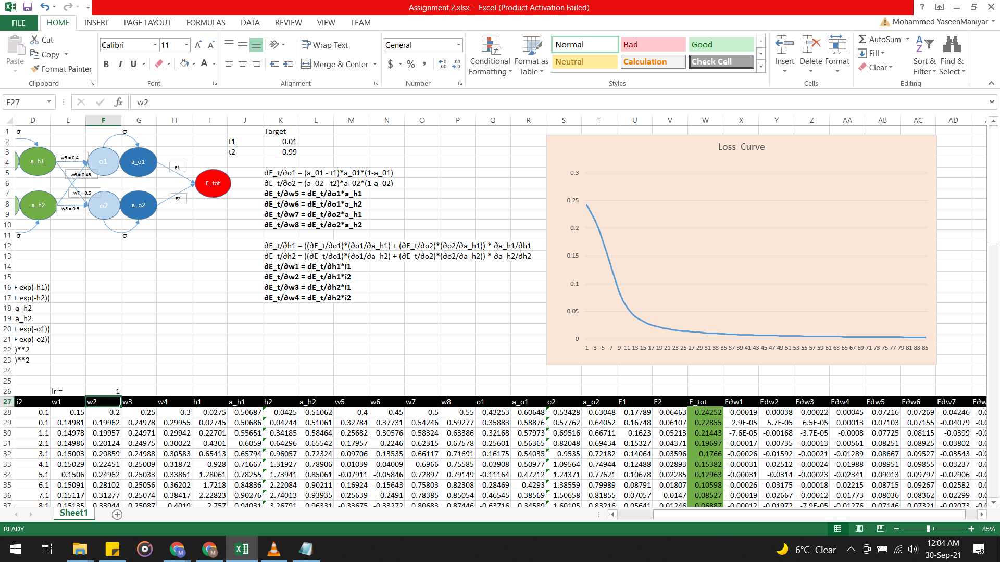
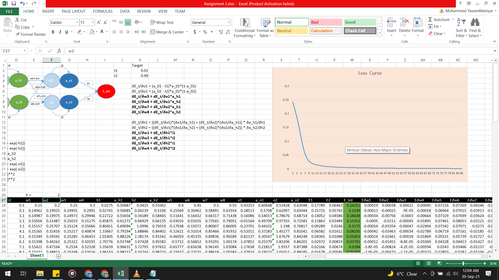

**Step 1 : Construct and visualise the neural network, initialize the weights randomly**  
Initialize the weights randomly, usually with mean 0 and variance 1. The small scale helps in better convergence. 
Below is a screenshot of the neural network and the randomly assigned weights. 

   

**Step 2 : Perform forward propagation**  
In each layer, perform the following operations in order to carry out forward propagation, until you receive the final output (in our case, a_o1 and a_o2) :  
1. Multiply the inputs with the respective weights to calculate the dot product for each neuron in the next layer.  
   Ex : h1 = w1*i1 + w2*i2  
2. A non linear activation function is then applied to the dot product to produce the output of the neuron. This helps to maintain non linearity and complexity across the network enabling it to learn complex tasks.  
   Ex : a_h1 = σ(h1) = 1/(1 + exp(-h1)) [Sigmoid Activation function] 
 

**Step 3 : Calculate the error / loss**  
After we receive our output, we can measure how different it is from expected output using a loss function. In our case, we have used square loss function. 
   E1 = 1/2 * (t1 - a_o1)**2  
   E2 = 1/2 * (t2 - a_o2)**2  
   E_tot = E1 + E2  
 

**Step 4 : Change the weights to minimise the loss**  
Since loss is a non linear function of weights, weights can be modified to minimise the loss by using gradient descent. 
   Ex : w1 = w1 - lr*∂E_t/∂w1  
Where lr stands for learning rate. lr helps to control the rate of change of weights, so as not to overdo it.  
For convenience, we can use the chain rule for calculating partial derivatives.  
   Ex : ∂E_t/∂w5 = dE_t/∂o1 * ∂o1/dw5  
Update all weights simultaneously.  
 

**Step 5 : Repeat steps 2, 3, 4 with same inputs and updated weights in each iteration**  
Over training, the loss will decrease as shown in Fig. Screenshot.  
 

**What happens if we change the learning rate ?**  
As we keep increasing the learning rate, the drop in loss gets sharper. Please see the figures below :  
lr : 0.1  
  
lr : 0.2  
  
lr : 0.5  
  
lr : 0.8  
  
lr : 1.0  
  
lr : 2.0  
  
 

Group 21 members :   

Mohammed Yaseen (47.yaseen@gmail.com) 
Mayank Singhal (singhal.mayank77@gmail.com) 
Ravi Vaishnav (ravivaishnav20@gmail.com) 
Sundeep Joshi 
